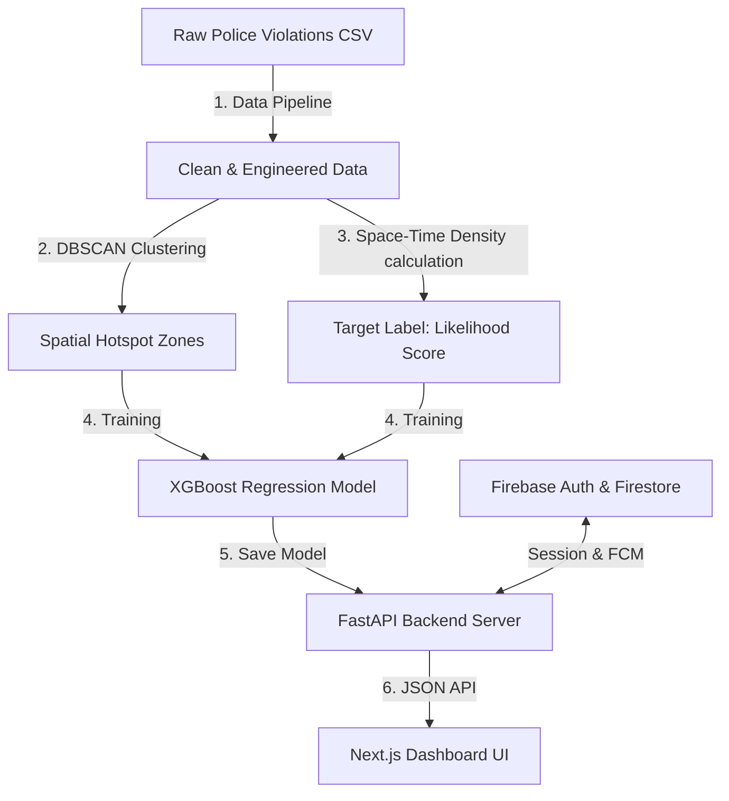

# 🚦 Gridlock — Smart Traffic Violation Prediction & Enforcement Intelligence

Gridlock is an AI-powered spatial analytics platform designed to transition parking and traffic violation enforcement from reactive patrols to predictive dispatch. By leveraging historical police violation datasets, the system identifies persistent spatial hotspots, models space-time violation density, and projects future violation likelihood with high accuracy.

---

## 🏗️ System Architecture & Workflow

Gridlock consists of three primary components working in tandem:



1. **The Machine Learning Pipeline (`/pipeline`)**: Clean raw datasets, perform spatial clustering, engineer temporal/spatial features, and train the predictive models.
2. **FastAPI Backend (`/backend`)**: Serves precomputed spatial hotspots from Firestore, runs real-time inference on the XGBoost regressor, manages operator sessions, and handles FCM push alert dispatches.
3. **Next.js Frontend (`/frontend`)**: A high-performance, responsive web dashboard featuring Leaflet map layers, dynamic heatmap toggling, detailed hotspot inspector sidebars, interactive violation logging forms, and Google Authentication.

---

## 📁 Repository Structure

```
gridlock/
├── backend/                       # FastAPI web application
│   ├── models/                    # Saved ML models (XGBoost .pkl)
│   ├── routes/                    # API sub-routers (Zones, Heatmap, Stats, Predict, Auth)
│   ├── data_loader.py             # Singleton in-memory data loader
│   ├── firebase_utils.py          # Firebase Admin SDK setup & auth dependencies
│   ├── session_manager.py         # Firestore session token CRUD operations
│   ├── schemas.py                 # Pydantic request/response validation schemas
│   └── main.py                    # Server entrypoint & CORS configuration
├── frontend/                      # Next.js web dashboard
│   ├── app/                       # Next.js App Router (pages & styles)
│   ├── components/                # Reusable React UI & Leaflet Map components
│   └── public/                    # Static assets & FCM Service Worker
├── pipeline/                      # Offline Data Cleaning & ML pipeline
│   ├── output/                    # Generated intermediate files (cleaned CSV, zones.geojson)
│   ├── clean.py                   # Data parsing, filtering, and feature engineering
│   ├── cluster.py                 # DBSCAN spatial clustering & polygon generation
│   └── score.py                   # XGBoost Regressor training & performance evaluation
├── PLAN.md                        # Master roadmap and design specifications
├── firebase.json                  # Firebase configuration
└── firebase-service-account.json  # Google Cloud service account credential key
```

---

## ⚡ Setup & Installation

### 1. Prerequisites
Ensure you have the following installed:
*   Python 3.10+
*   Node.js 18+ & npm
*   A Firebase project with Firestore and Authentication enabled

---

### 2. Run the Machine Learning Pipeline

Initialize the virtual environment, install dependencies, and run the pipeline scripts sequentially to generate the hotspots and train the regression model:

```bash
# Navigate to the backend or project root
cd backend
python -m venv .venv
source .venv/bin/activate
pip install -r requirements.txt

# Run Pipeline Stage 1: Data Cleaning & Feature Engineering
python ../pipeline/clean.py

# Run Pipeline Stage 2: DBSCAN Hotspot Clustering & Polygon Construction
python ../pipeline/cluster.py

# Run Pipeline Stage 3: XGBoost Regression Model Training
python ../pipeline/score.py
```

*Expected Output*: You will see evaluation metrics (RMSE ~ 0.076) and generated datasets inside `pipeline/output/` and the trained model `violation_likelihood.pkl` inside `backend/models/`.

---

### 3. Configure and Run the FastAPI Backend

1. Place your `firebase-service-account.json` credential file in the root directory.
2. Launch the development server:

```bash
cd backend
uvicorn main:app --reload --port 8000
```

The API will start running on [http://localhost:8000](http://localhost:8000) and auto-load the trained models and GeoJSON metadata into memory. You can view the interactive Swagger docs at `http://localhost:8000/docs`.

---

### 4. Setup and Run the Next.js Frontend

1. Navigate to the frontend directory:
   ```bash
   cd frontend
   npm install
   ```
2. Create a `.env.local` file in `/frontend` containing your Firebase Web App credentials:
   ```env
   NEXT_PUBLIC_FIREBASE_API_KEY=your-api-key
   NEXT_PUBLIC_FIREBASE_AUTH_DOMAIN=your-auth-domain
   NEXT_PUBLIC_FIREBASE_PROJECT_ID=your-project-id
   NEXT_PUBLIC_FIREBASE_MESSAGING_SENDER_ID=your-sender-id
   NEXT_PUBLIC_FIREBASE_APP_ID=your-app-id
   NEXT_PUBLIC_FIREBASE_VAPID_KEY=your-vapid-key
   NEXT_PUBLIC_API_URL=http://localhost:8000
   ```
3. Run the Next.js development server:
   ```bash
   npm run dev
   ```
   Open [http://localhost:3000](http://localhost:3000) in your browser to view the dashboard.

---

## 🌐 API Reference

| Endpoint | Method | Authentication | Description |
| :--- | :---: | :---: | :--- |
| `/` | `GET` | Public | Health check / Welcome status |
| `/api/stats` | `GET` | Public | Fetch overall statistics (total violations, peak hours, risk average) |
| `/api/zones` | `GET` | Public | Stream GeoJSON FeatureCollection of DBSCAN priority zones from Firestore |
| `/api/zones/{zone_id}` | `GET` | Public | Detail payload for a specific zone including coordinates, metrics, and AI brief |
| `/api/zones/{zone_id}/violations` | `POST` | Public | Register a new violation in Firestore (recalculates risk score and increments count) |
| `/api/heatmap/historical`| `GET` | Public | Downsampled raw coordinates for rendering the historical heatmap |
| `/api/heatmap/predicted` | `GET` | Public | Spatial coordinates grid populated with XGBoost likelihood predictions |
| `/api/predict` | `POST` | Public | Real-time predictive inference for a single coordinate & hour |
| `/api/auth/verify` | `POST` | Public | Verify Firebase client ID token and register user session |
| `/api/auth/logout` | `POST` | 🔒 JWT (Bearer) | Terminate current user session |
| `/api/register-fcm-token`| `POST`| 🔒 JWT (Bearer) | Save browser push notification token under user's profile and assign station |
| `/api/alert/dispatch` | `POST`| 🔒 JWT (Bearer) | Multicast FCM push alerts to operators assigned to the highest violation zone |

---

## 🔮 Core Predictive Architecture

### DBSCAN Clustering
Used to bundle individual scatter coordinates of violations into high-density zones:
*   **Metric**: Haversine (Great Circle) distance.
*   **Eps**: `200 meters` radius.
*   **Min Samples**: `5` violations minimum to qualify as a cluster.
*   **Polygon Estimation**: Constructs dynamic convex hulls (`scipy.spatial.ConvexHull`) around cluster coordinate outer-bounds, falling back to a regular hexagon geometry for linear/small clusters.

### XGBoost Likelihood Regressor
Predicts space-time violation density ($0.0 \rightarrow 1.0$) using a set of engineered features:
*   `latitude`, `longitude` (spatial coordinates)
*   `near_junction` (derived from junction names)
*   `cluster_density` (spatial density of DBSCAN cluster)
*   `repeat_location_count` (spatial violation history inside a 50m radius)
*   `hour` & `day_of_week` (temporal parameters)
*   `is_peak_hour` (weighted peak travel window hours)
*   `violation_weight` (severity weights based on violation types)
*   `police_station_load` & `is_near_commercial` (traffic draw proxies)

## ☁️ Cloud Data Migration & Geometry Workaround

To support real-time shared updates across all operator screens, the application's underlying zone database was migrated from the local `zones.geojson` asset to **Google Firestore** (collection: `zones`).

### 1. Geometry Serialization Workaround
Firestore restricts storing multi-dimensional arrays (such as GeoJSON coordinates for nested polygons like `[[[lng, lat], ...]]]`). To bypass this limitation:
* **Write / Serialization**: The backend serializes the GeoJSON `geometry` property into a standard JSON string before storing the zone document.
* **Read / Deserialization**: The in-memory data loader fetches the zone collection, parses the geometry JSON string back into objects, and streams a valid GeoJSON FeatureCollection to the client.

### 2. Auto-Migration Lifespan Hook
During FastAPI startup, the application verifies if the Firestore `zones` collection contains documents. If it is empty, the server automatically reads the local `pipeline/output/zones.geojson` backup and batch-uploads all 331 zones to Firestore.

---

## 🔔 Native Operator Alerts & Desktop Notifications

Rather than using inline Web-Toast popups that are easily missed when working across multiple browser windows, Gridlock is integrated with native OS-level desktop notifications.

### 1. Permission Prompt & Subscription
Upon logging in, enforcers are prompted to grant browser notification permissions. If approved, their FCM token is saved under their Firestore user profile, and they are dynamically assigned to a local police station sector.

### 2. Operator Alert Dispatch (`/api/alert/dispatch`)
When an operator triggers a push dispatch:
1. The backend determines the highest infraction zone (maximum `violation_count`).
2. It resolves the zone to its corresponding police station sector.
3. It queries Firestore for all active enforcers/operators assigned to that specific station and broadcasts a multicast FCM payload.

### 3. Click Refocus & Interactive Map Centering
If a native notification banner is clicked, a custom listener fires:
* It forces browser tab focus via `window.focus()`.
* It extracts the `zone_id` from the notification's payload.
* It highlights and selects the target zone on the Leaflet map overlay.
* It slides out the detailed zone inspection panel containing the violation breakdown and SHAP explainability charts.

---

## 📋 Interactive Infraction Registration Form

On the **System Logs** page, operators can log new parking and traffic infractions in real-time.
* **Firestore Data Persistence**: Submitting the form posts to `/api/zones/{zone_id}/violations` which directly increments the zone's violation count and updates its priority ranking in Firestore.
* **Hotspot Overlay Synchronization**: When a violation is added, the backend cache is invalidated, and the Leaflet map overlays are automatically re-rendered to reflect the updated statistics.

---

## 📜 License
This project is developed for hackathon purposes. All rights reserved.
