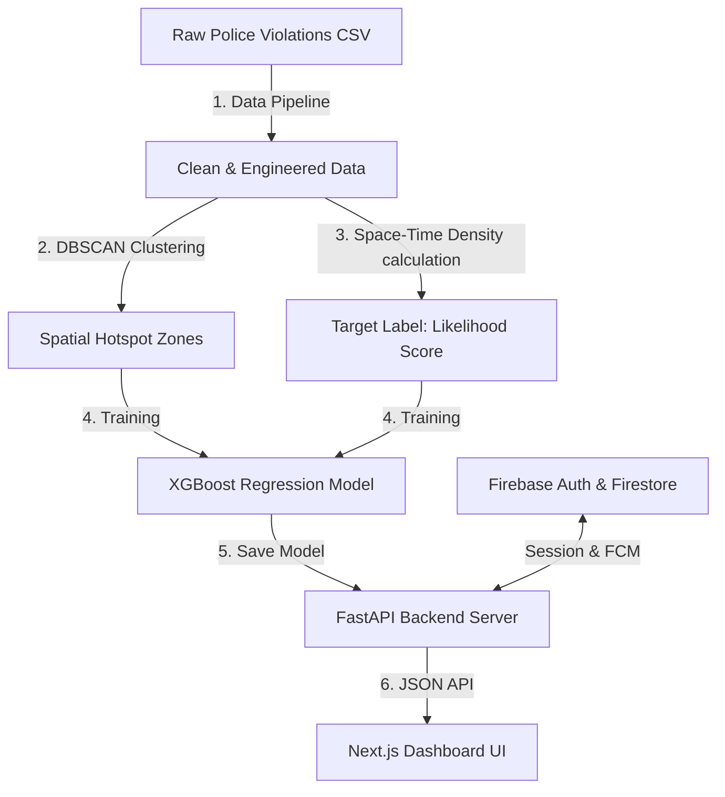

# 🚦 Gridlock — Smart Traffic Violation Prediction & Enforcement Intelligence

Gridlock is an AI-powered spatial analytics platform designed to transition parking and traffic violation enforcement from reactive patrols to predictive dispatch. By leveraging historical police violation datasets, the system identifies persistent spatial hotspots, models space-time violation density, and projects future violation likelihood with high accuracy.

---

## 🏗️ System Architecture & Workflow

Gridlock consists of three primary components working in tandem:



1. **The Machine Learning Pipeline (`/pipeline`)**: Clean raw datasets, perform spatial clustering, engineer temporal/spatial features, and train the predictive models.
2. **FastAPI Backend (`/backend`)**: Serve precomputed spatial hotspots, run real-time inference on the XGBoost regressor, manage sessions, and coordinate Firebase integrations.
3. **Next.js Frontend (`/frontend`)**: A high-performance responsive web dashboard featuring Leaflet map layers, dynamic heatmap toggling (historical vs. predicted), detailed hotspot inspector sidebars, and Google Authentication.

---

## 📁 Repository Structure

```
gridlock/
├── backend/                       # FastAPI web application
│   ├── models/                    # Saved ML models (XGBoost .pkl)
│   ├── routes/                    # API sub-routers (Zones, Heatmap, Stats, Predict, Auth)
│   ├── data_loader.py             # Singleton in-memory data loader
│   ├── firebase_utils.py          # Firebase Admin SDK setup & auth dependencies
│   ├── session_manager.py         # Firestore session token CRUD operations
│   ├── schemas.py                 # Pydantic request/response validation schemas
│   └── main.py                    # Server entrypoint & CORS configuration
├── frontend/                      # Next.js web dashboard
│   ├── app/                       # Next.js App Router (pages & styles)
│   ├── components/                # Reusable React UI & Leaflet Map components
│   └── public/                    # Static assets & FCM Service Worker
├── pipeline/                      # Offline Data Cleaning & ML pipeline
│   ├── output/                    # Generated intermediate files (cleaned CSV, zones.geojson)
│   ├── clean.py                   # Data parsing, filtering, and feature engineering
│   ├── cluster.py                 # DBSCAN spatial clustering & polygon generation
│   └── score.py                   # XGBoost Regressor training & performance evaluation
├── PLAN.md                        # Master roadmap and design specifications
├── firebase.json                  # Firebase configuration
└── firebase-service-account.json  # Google Cloud service account credential key
```

---

## ⚡ Setup & Installation

### 1. Prerequisites
Ensure you have the following installed:
*   Python 3.10+
*   Node.js 18+ & npm
*   A Firebase project with Firestore and Authentication enabled

---

### 2. Run the Machine Learning Pipeline

Initialize the virtual environment, install dependencies, and run the pipeline scripts sequentially to generate the hotspots and train the regression model:

```bash
# Navigate to the backend or project root
cd backend
python -m venv .venv
source .venv/bin/activate
pip install -r requirements.txt

# Run Pipeline Stage 1: Data Cleaning & Feature Engineering
python ../pipeline/clean.py

# Run Pipeline Stage 2: DBSCAN Hotspot Clustering & Polygon Construction
python ../pipeline/cluster.py

# Run Pipeline Stage 3: XGBoost Regression Model Training
python ../pipeline/score.py
```

*Expected Output*: You will see evaluation metrics (RMSE ~ 0.076) and generated datasets inside `pipeline/output/` and the trained model `violation_likelihood.pkl` inside `backend/models/`.

---

### 3. Configure and Run the FastAPI Backend

1. Place your `firebase-service-account.json` credential file in the root directory.
2. Launch the development server:

```bash
cd backend
uvicorn main:app --reload --port 8000
```

The API will start running on [http://localhost:8000](http://localhost:8000) and auto-load the trained models and GeoJSON metadata into memory. You can view the interactive Swagger docs at `http://localhost:8000/docs`.

---

### 4. Setup and Run the Next.js Frontend

1. Navigate to the frontend directory:
   ```bash
   cd frontend
   npm install
   ```
2. Create a `.env.local` file in `/frontend` containing your Firebase Web App credentials:
   ```env
   NEXT_PUBLIC_FIREBASE_API_KEY=your-api-key
   NEXT_PUBLIC_FIREBASE_AUTH_DOMAIN=your-auth-domain
   NEXT_PUBLIC_FIREBASE_PROJECT_ID=your-project-id
   NEXT_PUBLIC_FIREBASE_MESSAGING_SENDER_ID=your-sender-id
   NEXT_PUBLIC_FIREBASE_APP_ID=your-app-id
   NEXT_PUBLIC_FIREBASE_VAPID_KEY=your-vapid-key
   NEXT_PUBLIC_API_URL=http://localhost:8000
   ```
3. Run the Next.js development server:
   ```bash
   npm run dev
   ```
   Open [http://localhost:3000](http://localhost:3000) in your browser to view the dashboard.

---

## 🌐 API Reference

| Endpoint | Method | Authentication | Description |
| :--- | :---: | :---: | :--- |
| `/` | `GET` | Public | Health check / Welcome status |
| `/api/stats` | `GET` | Public | Fetch overall statistics (total violations, peak hours, risk average) |
| `/api/zones` | `GET` | Public | GeoJSON FeatureCollection of DBSCAN priority zones |
| `/api/zones/{zone_id}` | `GET` | Public | Detail payload for a specific zone including coordinates and metrics |
| `/api/heatmap/historical`| `GET` | Public | Downsampled raw coordinates for rendering the historical heatmap |
| `/api/heatmap/predicted` | `GET` | Public | Spatial coordinates grid populated with XGBoost likelihood predictions |
| `/api/predict` | `POST` | Public | Real-time predictive inference for a single coordinate & hour |
| `/api/auth/verify` | `POST` | Public | Verify Firebase client ID token and register user session |
| `/api/auth/logout` | `POST` | 🔒 JWT (Bearer) | Terminate current user session |
| `/api/register-fcm-token`| `POST`| 🔒 JWT (Bearer) | Save browser push notification token under user's profile |

---

## 🔮 Core Predictive Architecture

### DBSCAN Clustering
Used to bundle individual scatter coordinates of violations into high-density zones:
*   **Metric**: Haversine (Great Circle) distance.
*   **Eps**: `200 meters` radius.
*   **Min Samples**: `5` violations minimum to qualify as a cluster.
*   **Polygon Estimation**: Constructs dynamic convex hulls (`scipy.spatial.ConvexHull`) around cluster coordinate outer-bounds, falling back to a regular hexagon geometry for linear/small clusters.

### XGBoost Likelihood Regressor
Predicts space-time violation density ($0.0 \rightarrow 1.0$) using a set of engineered features:
*   `latitude`, `longitude` (spatial coordinates)
*   `near_junction` (derived from junction names)
*   `cluster_density` (spatial density of DBSCAN cluster)
*   `repeat_location_count` (spatial violation history inside a 50m radius)
*   `hour` & `day_of_week` (temporal parameters)
*   `is_peak_hour` (weighted peak travel window hours)
*   `violation_weight` (severity weights based on violation types)
*   `police_station_load` & `is_near_commercial` (traffic draw proxies)

---

## 📜 License
This project is developed for hackathon purposes. All rights reserved.
